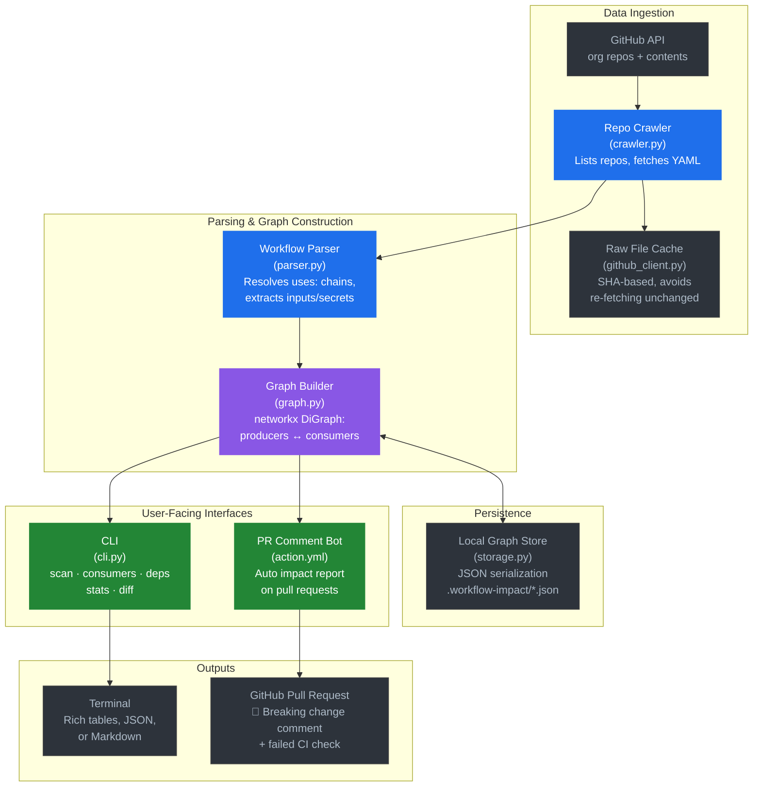
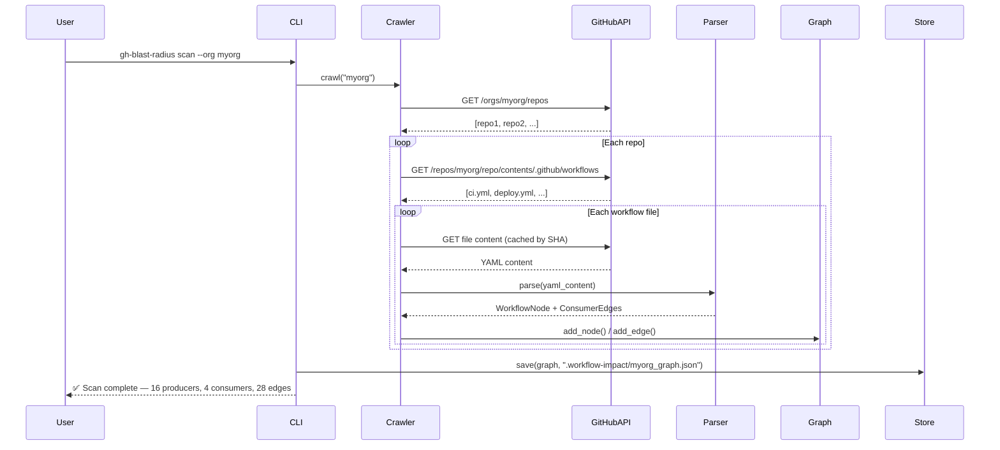
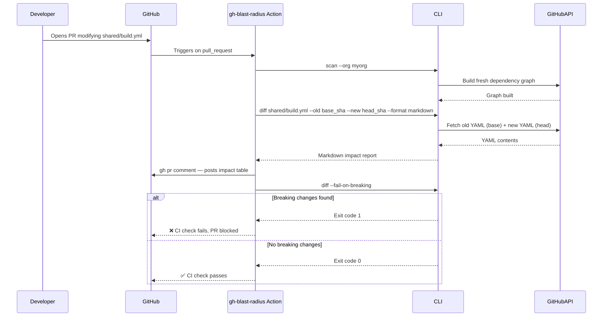

# Architecture

## System Overview

`gh-blast-radius` is composed of six core components that work together to map, cache, and analyze the dependency graph of GitHub Actions workflows across an entire organization.

## Component Details

| Component | File | Responsibility |
|-----------|------|----------------|
| **GitHub Client** | `github_client.py` | Authenticated HTTP client with rate-limit retry, pagination, and SHA-based file caching |
| **Repo Crawler** | `crawler.py` | Enumerates org repos, discovers `.github/workflows/` files, triggers lazy resolution of external refs |
| **Workflow Parser** | `parser.py` | Parses YAML with custom safe-loaders, extracts `inputs`, `secrets`, `outputs`, and `permissions` |
| **Dependency Graph** | `graph.py` | `networkx.DiGraph` wrapper — stores `WorkflowNode` producers and `ConsumerEdge` connections |
| **Graph Store** | `storage.py` | Serializes/deserializes the graph to `.workflow-impact/<org>_graph.json` |
| **CLI** | `cli.py` | Typer-based CLI exposing `scan`, `consumers`, `deps`, `stats`, and `diff` commands |
| **GitHub Action** | `action.yml` | Composite action wrapper — runs scan + diff inside CI, posts Markdown impact report as a PR comment |

## Data Flow

### Scan Flow

### PR Check Flow

